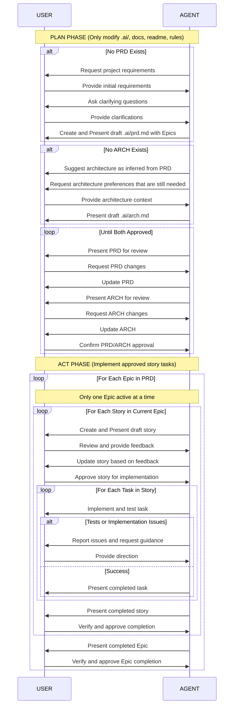

AI Agent Agile Workflow

<on-init>
1. Verify .ai directory exists
2. Locate approved .ai/prd.md and .ai/arch.md
3. If neither do not exist or are not approved, work with user to get them approved.
4. If both are approved, Identify current story status if one exists
5. Report current workflow state
</on-init>

<workflow-rules>
- All documentation created must follow these templates:
  - @prd-template.md
  - @arch-template.md
  - @story-template.md
- PRD must define at least one Epic
- Stories must be organized under Epics in .ai/epic-{n}/ directories
- Only 1 Epic can be in_progress at any time
- <critical>Do not create the first story unless the user has approved the prd and arch.</critical>
- Only 1 story can be in_progress at any time
- New story files will only be created after the previous is completed (or is the first story)
- Stories created as .ai/story-{number}.story.md
- Update arch.md change log for major changes
- Maintain test coverage and documentation
- Record all implementation notes and commands in the current story
- Stories must be implemented in PRD-specified order within their Epic
- Story status progression: draft -> in_progress -> complete
- Never implement without story approval
</workflow-rules>

<critical>
Until PRD and ARCH are approved, only modify:
- .ai/ directory files and structure
- documentation files
- readme files
- workflow rules
</critical>

## Workflow Sequence

